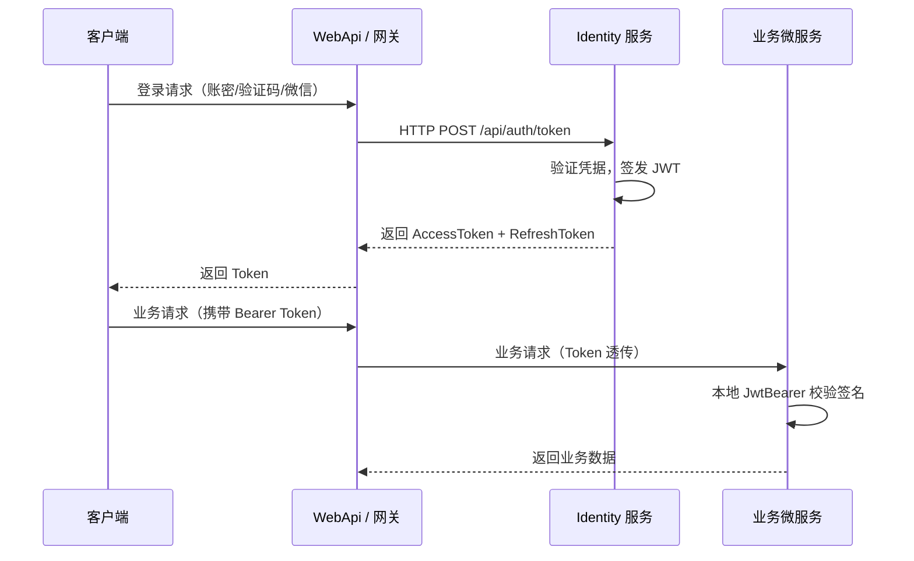

# QuantumZhou.Identity

统一身份与鉴权微服务（Identity Provider），基于 .NET 8 和 HTTP API 构建，负责集中处理用户认证并签发标准化 JWT。

## 设计原则

- **原生、无依赖**：完全基于 .NET 8 原生的 `System.IdentityModel.Tokens.Jwt` 和 ASP.NET Core 认证体系，不依赖第三方 Auth 框架
- **高扩展性**：采用策略模式支持多种认证方式，新增登录方式无需修改核心代码
- **高安全性**：RSA 密钥对动态生成 + AES-GCM 加密存储，AppSecret 防时序攻击，结构化日志记录
- **可观测性**：内置 OpenTelemetry 指标和追踪，支持 Prometheus 监控

## 快速开始

### 开发环境运行

```bash
cd backend/Host
dotnet run
```

服务默认监听：
- HTTP: `http://0.0.0.0:5002`
- Admin API 与管理控制台复用 HTTP 端口 `5002`

### Docker 部署

```bash
# 构建镜像
bash build.sh
```

### 环境要求

- .NET 8 SDK
- PostgreSQL 15+（默认）、MySQL 8.0/8.4、MariaDB 10.11/11.4，或单实例本地文件 SQLite
- Consul KV `config/ruoyu/identity.json` 中的 `Database:Provider`、`Database:ServerVersion` 和 `Database:ConnectionString`（容器部署）
- 环境变量 `RSA_MASTER_KEY`（用于 RSA 私钥加密，生产环境必须设置）
  - 生成示例：`openssl rand -base64 32`

## 项目结构

```
backend/
  Database/         - EF Core 数据访问层（实体、DbContext、迁移、仓储）
  Database.Migrations.MySql/  - MySQL 与 MariaDB 迁移链
  Database.Migrations.Sqlite/ - SQLite 迁移链
  Domain/           - 领域层（验证器、密钥管理、Token 服务、指标收集）
  Host/             - ASP.NET Core 宿主与启动配置（含 Controllers/AuthController）
  Tests/            - 单元测试与集成测试
admin_frontend/     - Vue 3 + Vite 管理控制台
docs/               - 设计文档
```

## 核心架构

### 中心化认证 + 去中心化无状态校验



- **HTTP 身份服务**：通过标准 Token、OIDC discovery 和 JWKS 端点提供认证能力
- **零代码引用隔离**：业务微服务无需引用 Identity 程序集，仅通过 `/.well-known/jwks` 拉取公钥
- **动态回调权限注入**：业务系统可注册回调接口，Identity 在签发 Token 时动态获取业务权限并注入 JWT
- **管理接口**：管理员能力统一通过独立端口的 Web Admin API 提供，支持用户管理、应用注册、回调管理和令牌吊销

## 支持的认证方式

基于 OAuth2 `grant_type` 策略模式设计：

| grant_type | 说明 | 状态 |
|---|---|---|
| `password` | 账密登录 | ✅ 已实现 |
| `refresh_token` | 刷新令牌 | ✅ 已实现 |
| `sms` | 短信验证码登录 | 🚧 骨架已搭建（需接入短信网关） |
| `wechat_code` | 微信扫码登录 | 🚧 骨架已搭建（需配置微信开放平台） |

新增认证方式只需实现 `IIdentityValidator` 接口并注册到 DI 容器。

## 数据库表结构

| 表名 | 说明 |
|---|---|
| `accounts` | 用户账户主表 |
| `password_credentials` | 用户名/密码凭据 |
| `user_logins` | 外部登录绑定（微信等） |
| `refresh_tokens` | 刷新令牌（支持吊销） |
| `app_registrations` | 业务系统注册与回调配置 |
| `security_keys` | RSA 密钥对（私钥加密存储） |
| `otps` | 短信登录一次性密码记录 |
| `login_attempts` | 登录尝试跟踪和锁定记录 |

详细表结构设计见 [数据库设计](docs/database/README.md)

## HTTP 认证 API

Identity 服务通过 HTTP REST 端点对外提供认证能力（Phase 2 后 gRPC 接口已移除）：

| 端点 | HTTP 方法 | 说明 |
|---|---|---|
| `/api/auth/token` | POST | 统一 Token 获取接口（支持多种 grant_type） |
| `/api/auth/sms-code` | POST | 请求短信验证码 |
| `/api/auth/revoke` | POST | 吊销刷新令牌 |
| `/api/auth/callback/register` | POST | 业务系统注册回调 |

AppId/AppSecret 通过 `X-Admin-AppId` / `X-Admin-AppSecret` 请求头传递。详细接口设计见 [Design.md](docs/overview/Design.md)。

## 安全特性

- **RSA + JWKS**：启动时动态生成 2048 位 RSA 密钥对，通过 `/.well-known/jwks` 暴露公钥
- **私钥加密存储**：使用 AES-GCM 加密后存入数据库，加密密钥来自环境变量 `RSA_MASTER_KEY`
- **防时序攻击**：AppSecret 比较使用 `CryptographicOperations.FixedTimeEquals`
- **密码哈希**：使用 BCrypt（WorkFactor 可配置，默认 11）
- **自动密钥轮换**：后台服务定期清理过期数据并轮换密钥（默认 30 天）
- **结构化日志**：所有核心服务均注入 `ILogger`，记录认证、回调、密钥操作等安全事件
- **登录锁定**：支持登录失败次数限制和账户锁定（可配置）
- **网关验证**：所有请求必须通过 AppId/AppSecret 验证
- **速率限制**：认证请求和 JWKS 端点均支持速率限制（默认 20 请求/分钟/客户端）

## 详细设计文档

- [数据库设计](docs/database/README.md)

## 配置说明

### appsettings.json 主要配置项

```json
{
  "Database": {
    "Provider": "PostgreSQL",
    "ServerVersion": "15",
    "ConnectionString": "Host=localhost;Port=5432;Database=quantumzhou_identity;Username=postgres;Password=postgres"
  },
  "Jwt": {
    "Issuer": "QuantumZhou.Identity",
    "Audience": "QuantumZhou.microservices",
    "TokenExpirationHours": 2
  },
  "RefreshToken": {
    "ExpirationDays": 7
  },
  "Sms": {
    "OtpTtlSeconds": 300,
    "MaxAttempts": 5,
    "LockoutSeconds": 600
  },
  "WeChat": {
    "AppId": "",
    "AppSecret": "",
    "ApiBaseUrl": "https://api.weixin.qq.com"
  },
  "RateLimiting": {
    "PermitLimitPerClient": 20,
    "WindowSeconds": 60
  },
  "BootstrapApps": {
    "FilePath": "/app/data/bootstrap-apps.json"
  }
}
```

### 环境变量

| 变量名 | 说明 | 是否必须 |
|---|---|---|
| `Database__Provider` | `PostgreSQL`、`MySQL`、`MariaDB` 或 `SQLite`；仅用于显式覆盖 Consul | 否 |
| `Database__ServerVersion` | 数据库服务器版本；SQLite 不得设置；仅用于显式覆盖 Consul | 非 SQLite 覆盖时必须 |
| `Database__ConnectionString` | 所选 Provider 的完整连接字符串；仅用于显式覆盖 Consul | 否 |
| `RSA_MASTER_KEY` | RSA 私钥加密主密钥 | 生产环境必须 |

## 监控与指标

服务内置 OpenTelemetry 支持，提供以下指标：

- `auth.login.success` - 成功登录次数
- `auth.login.failure` - 失败登录次数
- `auth.login.duration` - 登录请求耗时
- `auth.account.creation` - 账户创建次数

Prometheus 指标端点：`/metrics`

## 健康检查

- 健康检查端点：`/health`
- 数据库状态检查：包含在 `/health` 中

## 管理工具

项目提供基于 Vue 3 + Vite 的 Web 管理控制台，位于 `admin_frontend/` 目录，并通过独立端口的 Admin API 访问后端，支持：

- 用户管理（创建、查询、启用/禁用）
- 应用注册管理
- Token 管理
- 回调地址管理

开发模式下：

- 后端 Admin API 默认地址：`http://localhost:5002`
- 前端开发服务器默认地址：`http://localhost:5173`
- 管理端请求头需要携带 `X-Admin-AppId` 和 `X-Admin-AppSecret`
- 管理端不再提供单独的 gRPC 接口

## 开发与测试

### 运行单元测试

```bash
dotnet test
```

### 代码覆盖率

```bash
dotnet test --collect:"XPlat Code Coverage"
```

## 常见问题

### Q: 如何生成 RSA_MASTER_KEY？

```bash
openssl rand -base64 32
```

### Q: 数据库自动迁移是否可禁用？

Identity 服务启动时**无条件自动执行** EF Core 迁移和种子逻辑，无需手动执行迁移命令。

### Q: JWKS 端点访问频率限制是多少？

默认 20 请求/分钟/客户端，超过限制会返回 429 错误。
